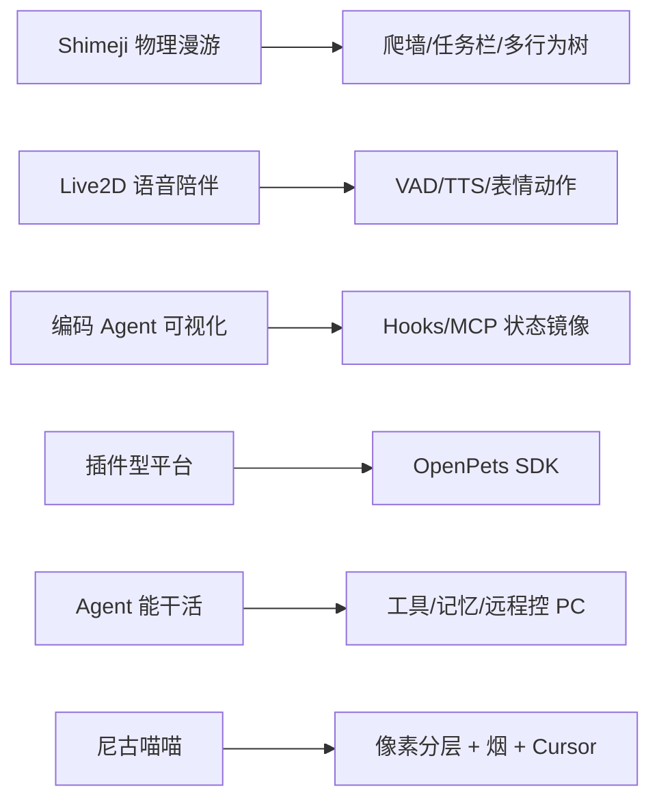

# 桌宠开源生态调研 · 尼古喵喵对标与路线图输入

给**项目管理 Agent**、**规划 Agent**、以及后续做竞品调研的 Agent 读。

本文档汇总 GitHub 上与本项目方向相近的开源桌宠项目，输出两类结论：

1. **可优化尼古喵喵的设计**（可拆成 Epic / Story / Task）
2. **与众不同的功能或设计**（差异化参考，不一定纳入路线图）

调研结论与 `docs/agent-split.md` 的 Wave 规划对齐；新增工作项应通过 PM Agent 拆解后再派工，**不要**在本文件里直接改「可写路径」或指派 Cloud Agent。

---

## 文档维护约定

| 项 | 说明 |
|----|------|
| **真源路径** | `docs/desktop-pet-landscape.md`（本文件） |
| **更新时机** | 每次竞品调研、用户指定新项目对标、或某参考仓库 Release 大版本变更 |
| **谁维护** | 做调研的 Agent 在 PR 中更新「调研日志」与相关章节，并 bump 文末 `last_reviewed` |
| **不要做的事** | 不在这里改 `agent-split.md` 的契约；不替代 `visual-optimization-brief.md` 的视觉验收 |
| **PM 用法** | 读 §6「PM 拆解清单」→ 按优先级生成 Epic → 对照 §4 依赖与 Wave → 写入各自 plan/issue |

### 调研日志（倒序）

| 日期 | 执行者 | 摘要 |
|------|--------|------|
| 2026-08-20 | Cloud Agent（首轮） | 初版：覆盖 15+ GitHub 项目；归纳 5 条行业路线；输出 P0–P3 优先级与 PM 拆解表 |

---

## 1. 尼古喵喵现状（对标基准）

> 本节描述**调研当时**的基线；若 Wave 1 PR 合入，PM 应同步更新本节。

### 1.1 产品定位

- **名称**：尼古喵喵桌面助手
- **人设**：猫耳少女，语气颓、爱抽烟；能语音闲聊，能把写代码的活交给 Cursor
- **视觉主路径**：240×336 分层像素木偶（`assets/pixel`，Pixi `NEAREST`），**不是** Live2D 主路径
- **技术栈**：Electron 覆盖层 + monorepo（`apps/desktop`、`packages/core|voice|agent`）

### 1.2 已实现 / 在途能力

| 能力 | 状态 | 代码/资产 |
|------|------|-----------|
| 透明双窗（角色 + 全屏烟粒子） | 已实现 | `windows.ts`：character + smoke |
| 像素渲染器 + Live2D/Sprite 回退 | Wave 1 在途 | `PixelRenderer.ts`、`createCharacterRenderer.ts` |
| STT / TTS（Edge 默认） | 已实现 | `packages/voice` |
| LLM 闲聊 + 工具调用 | 已实现 | `packages/core`、`packages/agent` |
| Cursor CLI 桥 | 已实现 | `agent -p` / `cursor <path>` |
| 按句播放 + RMS 口型 | Wave 1 S-Speech | `main/index.ts`、`character.ts` |
| 烟窗 idle 降耗 | Wave 1 R-Smoke | `SmokeField.ts`、`smoke.ts` |

### 1.3 已规划但未做（Wave 2，见 agent-split §10）

| 代号 | 内容 |
|------|------|
| W2-Clone | 本机 9880 克隆音色说明 |
| W2-Stream | LLM 流式 + 按句 TTS |
| W2-Shell | hide 烟窗、点击穿透、隐藏停画 |
| W2-SFX | 吸吐短 WAV |

### 1.4 本项目已有差异化（调研结论）

以下组合在开源桌宠中**相对少见**，拆解任务时应避免稀释：

- **人设绑定独立烟粒子窗**（角色层不画烟，全屏粒子吐烟）
- **颓系猫耳少女 IP + Cursor 编码桥**（非泛用插件平台）
- **AI 生成分层像素资产管线**（P-Gen：模型出图 → 切层 → `sheet.json`），而非 Shimeji 精灵集或 Live2D 商城模型

---

## 2. 调研方法与范围

### 2.1 检索维度

- 关键词：`desktop pet`、`桌宠`、`shimeji`、`Live2D assistant`、`electron overlay`、`tauri pet`、`coding agent pet`
- 平台：GitHub（2024–2026 活跃项目为主）
- 筛选：Electron / Tauri 桌面覆盖层；有 README 或 Release；与「陪伴 / AI / 编码助手」至少命中一项

### 2.2 未纳入

- 纯网页 / VS Code 插件（如 vscode-pets）—— 非桌面覆盖层
- 无公开仓库或 README 极少的小 fork
- Live2D 官方 SDK 示例本身（非产品）

### 2.3 行业五条路线（Taxonomy）



| 路线 | 代表项目 | 与尼古喵喵关系 |
|------|----------|----------------|
| A Shimeji 物理漫游 | Desktop-Virtual-buddy, Convai | 可借鉴 ambient 行为；非主路径 |
| B Live2D 语音陪伴 | deskpet, petto, AI-Desktop-Pet | 语音管线、记忆、VAD 可借鉴 |
| C 编码 Agent 可视化 | Clyde, aemeath, mikari | **高度相关**，优先对标 |
| D 插件型平台 | OpenPets | 长期平台化参考 |
| E Agent 能干活 | Hiyori, DeskPet-Furina | 工具审计、多 provider 可参考 |

---

## 3. 参考项目目录（Catalog）

> Stars 为调研日近似值，会变动；维护时以 GitHub 为准。

| ID | 仓库 | Stars≈ | 栈 | 一句话 |
|----|------|--------|-----|--------|
| R01 | [alvinunreal/openpets](https://github.com/alvinunreal/openpets) | 980+ | Electron/TS | 插件平台 + MCP agent 联动 |
| R02 | [SeakMengs/WindowPet](https://github.com/SeakMengs/WindowPet) | 650+ | Tauri/React | 多宠 overlay、点击穿透、任务栏上 |
| R03 | [ppxinyue/DeskCat](https://github.com/ppxinyue/DeskCat) | 中 | Electron/React | Timeline、专注、编码 agent、自定义素材 |
| R04 | [DennyWanye/deskpet](https://github.com/DennyWanye/deskpet) | 中 | Tauri+Python | 本地 VAD→ASR→LLM→TTS + Live2D |
| R05 | [funnycups/petto](https://github.com/funnycups/petto) | 110+ | — | Live2D + 流式语音 + 情境问候 |
| R06 | [ruguo0119/AI-Desktop-Pet](https://github.com/ruguo0119/AI-Desktop-Pet) | 中 | Electron/React | Live2D + ChromaDB 记忆 + VAD 状态机 |
| R07 | [QingJ01/Clyde](https://github.com/QingJ01/Clyde) | 中 | Tauri/Svelte/Rust | **编码 Agent 状态实时镜像** |
| R08 | [77wliNd/aemeath_withclaude](https://github.com/77wliNd/aemeath_withclaude) | 小 | Tauri/Rust | 像素 + Claude hooks/MCP 双向 |
| R09 | [ZO1DB3RG/mikari-claude-pet](https://github.com/ZO1DB3RG/mikari-claude-pet) | 小 | Tauri/Rust | 同上，macOS 透明窗 |
| R10 | [AkshitIreddy/convai-desktop-pet](https://github.com/AkshitIreddy/convai-desktop-pet) | 中 | Tauri | Shimeji 行为 + WebRTC 语音 + 技能轮盘 |
| R11 | [spyderweb47/Desktop-Virtual-buddy](https://github.com/spyderweb47/Desktop-Virtual-buddy) | 小 | Electron/TS | Shimeji 46pose + Vision LLM 选行为 |
| R12 | [duzexu/desktop-pet](https://github.com/duzexu/desktop-pet) | 16 | Electron | `.petpack` + 规则引擎 + 控制面板 |
| R13 | [Ice-teapop/desktop-pet](https://github.com/Ice-teapop/desktop-pet) | 中 | Electron/React | 6 LLM fallback + 工具审批审计 |
| R14 | [NyachoFlow/YRChat](https://github.com/NyachoFlow/YRChat) | 小 | Tauri/React | Galgame UI + 屏幕记忆 |
| R15 | [luckui/ai-live2d-go](https://github.com/luckui/ai-live2d-go) | 中 | Go | 40+ 工具 Agent + Discord/微信控 PC |
| R16 | [Tosuke-sama/DesktopFriends](https://github.com/Tosuke-sama/DesktopFriends) | 小 | Tauri | Live2D + ReAct + LAN 多宠 |
| R17 | [berkecuhadar/IsmetBuddy](https://github.com/berkecuhadar/IsmetBuddy) | 小 | Electron | 像素 + 屏幕边缘 + 多显示器 |
| R18 | [booleamu/DesktopPet](https://github.com/booleamu/DesktopPet) | 小 | Electron | 像素猫 + 右键菜单多状态 |
| R19 | [saagpatel/DesktopPet](https://github.com/saagpatel/DesktopPet) | 小 | Tauri | 番茄钟 + XP/进化游戏化 |

---

## 4. 可优化尼古喵喵的设计（§A）

每项含：**来源**、**做法摘要**、**对本项目的价值**、**建议优先级**、**依赖/冲突**、**验收要点**（供 PM 写 AC）。

---

### A1. 动态点击穿透 + 角色 Hitbox

| 字段 | 内容 |
|------|------|
| 来源 | R02 WindowPet；R12 duzexu/desktop-pet；R18 booleamu |
| 做法 | 窗口默认可穿透；鼠标在角色非透明像素或 UI 热区时关闭穿透；离开再打开 |
| 价值 | 桌宠「贴桌面」体验的核心；空区域不挡操作 |
| 优先级 | **P0** |
| 依赖 | 与 W2-Shell 强相关；需 Electron `setIgnoreMouseEvents(true, { forward: true })` + 渲染进程 hit test 或主进程 bounds |
| 冲突 | 与「按住角色说话」拖拽热区需统一 |
| 验收 | 透明区域点击落到下层窗口；角色身体/气泡/输入框可交互；拖拽与穿透切换无闪烁 |

**PM Epic 建议 ID**：`EPIC-W2-SHELL-PASSTHROUGH`

---

### A2. VAD + 流式 ASR + 可打断 TTS

| 字段 | 内容 |
|------|------|
| 来源 | R04 deskpet；R05 petto；R06 AI-Desktop-Pet |
| 做法 | Silero VAD 检测说话起止；流式 MASR 或分段 Whisper；TTS 播放中收到新 utterance 则 stop + 清队列 |
| 价值 | 降低「按住说话」延迟；更接近自然对话 |
| 优先级 | **P0**（语音体验） |
| 依赖 | S-Speech 按句队列；`packages/voice` 扩展；可选 WebSocket 到本地 faster-whisper |
| 冲突 | Wave 1 S-Speech 若已合入按句逻辑，本项为增量 |
| 验收 | 连续说两句无需两次按键；说话过程中可打断上一句；口型 RMS 仍同步 |

**PM Epic 建议 ID**：`EPIC-W2-VOICE-PIPELINE`

---

### A3. 对话 / 角色状态机（与人设绑定）

| 字段 | 内容 |
|------|------|
| 来源 | R06 AI-Desktop-Pet；契约 `agent-split.md` §2 渲染选择 |
| 做法 | 显式状态：`Idle` / `Listening` / `Thinking` / `Speaking` / `Inhale` / `Exhale`；驱动眼嘴层与 smoke intensity |
| 价值 | 统一 main、renderer、voice 三处隐式 flag（`busy`、`speaking`、`pose`） |
| 优先级 | **P0** |
| 依赖 | P-Puppet PixelRenderer；R-Smoke 烟量联动 |
| 冲突 | 无 |
| 验收 | 状态转移可日志追踪；每种状态对应固定像素层组合；非法转移被拒绝 |

**PM Epic 建议 ID**：`EPIC-W1-STATE-MACHINE`（可并入 S-Speech / P-Puppet）

---

### A4. Agent 状态 → 像素动画映射（Cursor / 编码任务可视化）

| 字段 | 内容 |
|------|------|
| 来源 | R07 Clyde；R08 aemeath；R09 mikari；R01 OpenPets MCP |
| 做法 | 订阅编码 agent 生命周期（SessionStart、tool call、permission、complete）；映射到 8–15 种 pose + 气泡文案 + 最小停留时间防抖 |
| 价值 | **尼古喵喵最大差异化增强**；「帮写代码」不只是对话框里一句话 |
| 优先级 | **P0**（产品差异化） |
| 依赖 | 现有 `packages/agent` Cursor 桥；可选 HTTP hook 或 MCP server（参考 aemeath `:9527/:9528`） |
| 冲突 | 与 Wave 2 ACP 流式会话规划协同，不重复造轮 |
| 验收 | Cursor 任务执行中角色呈「忙碌/打字」态；权限弹窗时角色提醒；完成后庆祝/回归 idle |

**PM Epic 建议 ID**：`EPIC-W2-AGENT-VISUAL`

**建议 Story 拆分**：

1. 定义 `AgentPhase` 枚举与 pose/smoke/bubble 映射表（JSON 或 TS const）
2. Cursor CLI stderr/stdout 或 `--print` 进度解析（最小可行）
3. 可选：HTTP hook 接收 Cursor Cloud Agent 事件（与 OpenPets 对齐）
4. 气泡锁：同一 phase 最小展示 800ms，防闪烁（aemeath 做法）

---

### A5. 情境主动发言（非仅响应用户）

| 字段 | 内容 |
|------|------|
| 来源 | R05 petto；R11 Desktop-Virtual-buddy；R06 主动发言 |
| 做法 | 定时或事件触发：前台窗口标题、空闲时长、关键词「看看」→ 截屏 → LLM 生成一句短评 |
| 价值 | 强化「颓系陪写代码」人设 |
| 优先级 | **P1** |
| 依赖 | LLM API；隐私开关；截屏权限 |
| 冲突 | 需默认关闭或强提示，避免打扰 |
| 验收 | 设置中可关；触发频率可配；不会在 Speaking 时重叠播报 |

**PM Epic 建议 ID**：`EPIC-W3-PROACTIVE`

---

### A6. 资产包规范（niko.petpack）

| 字段 | 内容 |
|------|------|
| 来源 | R12 duzexu `.petpack` |
| 做法 | 打包 `sheet.json` + `layers/` + `preview.png` + `gen-log.md`；导入校验尺寸与层名 |
| 价值 | P-Gen 与 P-Puppet 解耦；换皮不换代码 |
| 优先级 | **P1** |
| 依赖 | P-Gen 完成；契约层名已冻结 |
| 冲突 | 无 |
| 验收 | 导出 zip 再导入后渲染一致；缺层回退占位 |

**PM Epic 建议 ID**：`EPIC-W2-ASSET-PACK`

---

### A7. LLM 多 Provider Fallback

| 字段 | 内容 |
|------|------|
| 来源 | R13 Ice-teapop/desktop-pet |
| 做法 | 配置多 endpoint；失败自动下一个；Settings 统一密钥管理 |
| 价值 | 国内/API 抖动时桌宠仍能说话 |
| 优先级 | **P1** |
| 依赖 | `packages/core` NikoChat |
| 冲突 | 无 |
| 验收 | 主 API 502 时自动切备用；用户可见当前 provider |

**PM Epic 建议 ID**：`EPIC-W2-LLM-FALLBACK`

---

### A8. 工具调用审批 + 本地审计日志

| 字段 | 内容 |
|------|------|
| 来源 | R13 DeskPet-Furina；现有 `confirm` dialog |
| 做法 | 高危工具（写文件、跑命令）逐次确认；`~/.niko/audit.log` JSONL |
| 价值 | Agent 能力增强时的安全网 |
| 优先级 | **P1** |
| 依赖 | `packages/agent` executeTool |
| 冲突 | 已有 `confirm` 回调，扩展即可 |
| 验收 | 每次 confirm/deny 有日志；日志不含 API key |

**PM Epic 建议 ID**：`EPIC-W2-AGENT-AUDIT`

---

### A9. 交互规则引擎（条件 → 动作 → 冷却）

| 字段 | 内容 |
|------|------|
| 来源 | R12 duzexu Rules 页 |
| 做法 | JSON 规则：`on: click|idle_30s|drag_end` → `play: blink|puff|bubble`；priority + cooldown |
| 价值 | 减少硬编码 idle 逻辑；方便 PM 加小行为而不改 TS |
| 优先级 | **P2** |
| 依赖 | A3 状态机 |
| 冲突 | 无 |
| 验收 | 修改 JSON 后重启或热加载生效；规则冲突按 priority 解析 |

**PM Epic 建议 ID**：`EPIC-W3-RULE-ENGINE`

---

### A10. 跨平台窗口「始终可见」策略

| 字段 | 内容 |
|------|------|
| 来源 | R03 DeskCat |
| 做法 | macOS `panel` + `visibleOnFullScreen`；Windows 全屏应用恢复 topmost |
| 价值 | 游戏/全屏 IDE 时桌宠仍可见 |
| 优先级 | **P2** |
| 依赖 | `windows.ts` |
| 冲突 | 无 |
| 验收 | Win/mac 全屏场景手动测；不抢焦点 |

**PM Epic 建议 ID**：`EPIC-W3-WINDOW-POLICY`

---

### A11. 长期向量记忆

| 字段 | 内容 |
|------|------|
| 来源 | R06 ChromaDB；R15 Hermes memory |
| 做法 | 对话 embedding 入库；检索注入 system prompt；带时间戳事实 JSON |
| 价值 | 「记住用户偏好」；Wave 2 后增强陪伴感 |
| 优先级 | **P2** |
| 依赖 | 本地或云端向量库；隐私说明 |
| 冲突 | 与「颓系短句」人设需控 token |
| 验收 | 重启后仍记得用户自称；可清空记忆 |

**PM Epic 建议 ID**：`EPIC-W3-MEMORY`

---

### A12. 性能：烟窗 hide / 单 overlay 评估

| 字段 | 内容 |
|------|------|
| 来源 | R10 convai 单 overlay；R01；agent-split W2-Shell |
| 做法 | 隐藏烟窗或 idle 停 ticker（R-Smoke 已做一部分）；评估 character+smoke 合并为单 WebGL 层 |
| 价值 | 笔记本续航与 GPU |
| 优先级 | **P1**（W2-Shell 已列） |
| 依赖 | R-Smoke 合入 |
| 冲突 | 全屏烟与角色分层合成复杂度 |
| 验收 | idle 5min CPU/GPU 占用下降；吐烟时视觉无回归 |

**PM Epic 建议 ID**：`EPIC-W2-SHELL`（与 A1 同 Epic 不同 Story）

---

## 5. 与众不同的功能或设计（§B）

> 本节供差异化决策；**默认不进入 Wave 2**，除非 PM 单独立项。

### B1. Shimeji 物理漫游（爬墙、天花板、扔掷粘附）

- **代表**：R11 Desktop-Virtual-buddy、R10 Convai
- **特点**：46pose 规范、重力、墙/天花板行为树
- **与尼古喵喵**：当前固定角落 + 脚贴底锚点；若做需新 geometry + 物理循环，**改动面大**
- **建议**：Wave 4+ 或 spin-off；不稀释像素静态分层优势

### B2. 多宠同屏与宠物社交

- **代表**：R02 WindowPet、R10 friend chat / dance party、R16 LAN 多宠
- **特点**：多实例、follow-the-leader、taskbar parade
- **建议**：非核心；若做优先「第二个尼古喵喵」彩蛋而非通用多宠平台

### B3. 插件 SDK / 官方插件目录

- **代表**：R01 OpenPets Plugin SDK v3
- **特点**：沙箱 JS/TS、权限、quota、Control Center
- **建议**：长期平台化；短期用 `packages/agent` 工具注册表代替

### B4. 生产力游戏化（番茄钟、XP、进化）

- **代表**：R19 saagpatel/DesktopPet、R01 官方插件
- **特点**：专注会话 → 金币 → 装扮
- **建议**：与人设「颓」冲突需谨慎；可做「拖延嘲讽」轻量版而非正经 Pomodoro

### B5. Timeline / 一日回顾

- **代表**：R03 DeskCat
- **特点**：聊天、专注、编码事件时间线
- **建议**：偏工具型；可作为设置页二级功能

### B6. Galgame 式 UI（立绘 + 对话框分窗）

- **代表**：R14 YRChat
- **特点**：TachieApp / DialogApp 分离；打字机效果
- **建议**：与当前「小窗宠物 + 底部输入」不同范式；不优先

### B7. WebRTC 实时语音（Convai）

- **代表**：R10
- **特点**：电话式低延迟对话，非按句 TTS
- **建议**：架构差异大；除非重做 voice 栈

### B8. 远程控 PC（Discord / 微信）

- **代表**：R15 Hiyori
- **特点**：手机发令 → 桌面 Agent 执行
- **建议**：安全面高；Wave 4+

### B9. Vision LLM 驱动 idle 行为

- **代表**：R11
- **特点**：周期截屏 → LLM 返回 walk/climb/speech
- **建议**：与 A5 主动发言合并规划时可复用截屏管线

### B10. 技能轮盘 Radial UI

- **代表**：R10
- **特点**：点宠弹出 8 槽技能环
- **建议**：可选交互实验；替代部分右键菜单

---

## 6. PM 拆解清单（可直接生成 Epic）

### 6.1 优先级总表

| 优先级 | Epic ID | 标题 | 建议 Wave | 主要参考 |
|--------|---------|------|-----------|----------|
| P0 | EPIC-W2-SHELL-PASSTHROUGH | 点击穿透 + Hitbox | W2 | R02, R12 |
| P0 | EPIC-W2-VOICE-PIPELINE | VAD / 流式 ASR / 打断 TTS | W2 | R04–R06 |
| P0 | EPIC-W1-STATE-MACHINE | 角色对话状态机 | W1–W2 | R06, 契约 §2 |
| P0 | EPIC-W2-AGENT-VISUAL | 编码 Agent 状态可视化 | W2 | R07–R09 |
| P1 | EPIC-W2-SHELL | 烟窗 hide + idle 停画 | W2 | agent-split W2-Shell |
| P1 | EPIC-W2-LLM-FALLBACK | 多 Provider 降级 | W2 | R13 |
| P1 | EPIC-W2-AGENT-AUDIT | 工具审批与审计日志 | W2 | R13 |
| P1 | EPIC-W2-ASSET-PACK | niko.petpack 资产包 | W2 | R12 |
| P1 | EPIC-W3-PROACTIVE | 情境主动发言 | W3 | R05, R11 |
| P2 | EPIC-W3-RULE-ENGINE | 交互规则引擎 | W3 | R12 |
| P2 | EPIC-W3-WINDOW-POLICY | 跨平台置顶策略 | W3 | R03 |
| P2 | EPIC-W3-MEMORY | 向量长期记忆 | W3 | R06, R15 |
| P3 | EPIC-W4-SHIMEJI | Shimeji 漫游（可选） | W4+ | R10, R11 |
| P3 | EPIC-W4-PLUGIN-SDK | 插件平台（可选） | W4+ | R01 |

### 6.2 Wave 2 建议合并顺序（PM 派工）

与 `agent-split.md` §10 对齐并扩展：

```
1. V-Timbre、R-Smoke（已在 Wave 1）
2. P-Puppet + EPIC-W1-STATE-MACHINE（最小状态枚举）
3. P-Gen 资源合入
4. S-Speech + EPIC-W2-VOICE-PIPELINE（增量）
5. W2-Stream（LLM 流式 + 按句 TTS）
6. EPIC-W2-AGENT-VISUAL（依赖 Stream 时可并行 Story 1–2）
7. EPIC-W2-SHELL + EPIC-W2-SHELL-PASSTHROUGH（串行：先 hide/停画，再穿透）
8. W2-SFX
9. EPIC-W2-LLM-FALLBACK、EPIC-W2-AGENT-AUDIT（可并行）
10. W2-Clone
```

**硬约束**：`W2-Stream` 与 `W2-Shell` 仍串行（改同一 `main/index.ts` / `windows.ts` 时 PM 需排期）。

### 6.3 Story 模板（复制到 issue）

```markdown
## Story: [标题]

**Epic**: EPIC-xxx
**参考仓库**: R07 Clyde（链接）
**可写路径**: （PM 填写，须符合 agent-split）
**依赖**: Story xxx 合入

### 背景
（从本文档 §A 拷贝「价值」）

### 任务
- [ ] …
- [ ] …

### 验收标准
- [ ] （从本文档 §A「验收」拷贝）

### 非目标
- …
```

### 6.4 给 PM Agent 的提示词片段

```
请读 docs/desktop-pet-landscape.md §6 PM 拆解清单。
基于 P0/P1 项生成 Epic 与 Story，写入你的 plan 工具。
每个 Story 必须：
1. 引用参考仓库 ID（R01–R19）
2. 指定 Wave 与依赖
3. 对照 agent-split.md 分配可写路径；若无对应 Agent，提议新代号
4. 不要修改 docs/agent-split.md 冻结契约（层名、240×336、sheet.json 字段）
更新 docs/desktop-pet-landscape.md 调研日志当派工完成时。
```

---

## 7. 与现有文档的关系

| 文档 | 关系 |
|------|------|
| [agent-split.md](./agent-split.md) | Wave 1 派工真源；本调研 **不替代** 其契约与可写路径 |
| [visual-optimization-brief.md](./visual-optimization-brief.md) | 视觉验收；像素风对标 R08/R18，但不抄角色 |
| [persona.md](./persona.md) | 人设语气；主动发言、Agent 气泡须符合人设 |
| [live2d-spec.md](./live2d-spec.md) | Live2D 为保留管线；主流竞品用 Live2D，本项目主路径是 pixel |

---

## 8. 后续调研维护指南

### 8.1 新项目入库 Checklist

- [ ] 在 §3 Catalog 追加一行（ID 递增 R20…）
- [ ] 判断属于 §2.3 哪条路线
- [ ] 若有可借鉴点：在 §4 增 `Axx` 小节或合并到现有 A 项
- [ ] 若 purely 差异化：在 §5 增 `Bxx`
- [ ] 更新 §6.1 优先级表（若影响 roadmap）
- [ ] 在「调研日志」追加一行

### 8.2 定期复查（建议每季度）

- OpenPets / WindowPet / DeskCat / Clyde Release 说明
- 有无新的「编码 Agent 桌宠」类项目（R07–R09 赛道）
- Stars / 架构变化是否推翻 P0 排序

### 8.3 禁止事项

- 不要把竞品 PNG/Live2D 模型复制进 `assets/`
- 不要因调研修改 `sheet.json` 层名或画布尺寸
- 不要用调研结论直接推默认分支

---

## 9. 附录：参考项目能力矩阵

| 能力 | R01 | R02 | R06 | R07 | R08 | R10 | R12 | R13 | Niko |
|------|:---:|:---:|:---:|:---:|:---:|:---:|:---:|:---:|:----:|
| 透明穿透 | ● | ● | ○ | ● | ● | ● | ● | ● | ○ |
| 像素风 | ○ | ○ | ○ | ○ | ● | ○ | ○ | ● | ● |
| Live2D | ○ | ○ | ● | ○ | ○ | ○ | ○ | ○ | △ |
| VAD/流式语音 | ○ | ○ | ● | ○ | ○ | ● | ○ | ○ | ○ |
| 长期记忆 | ○ | ○ | ● | ○ | ○ | ● | ○ | ○ | ○ |
| 编码 Agent 联动 | ● | ○ | ○ | ● | ● | ○ | ○ | ○ | △ |
| 插件/规则引擎 | ● | ○ | ○ | ○ | ○ | ● | ● | ○ | ○ |
| Shimeji 漫游 | ○ | ○ | ○ | ○ | ○ | ● | ○ | ○ | ○ |
| 独立粒子/特效 | ○ | ○ | ○ | ○ | ○ | ○ | ○ | ○ | ● |

图例：● 强 / △ 部分 / ○ 无或弱 · **Niko** 列表示调研基线，Wave 合入后由 PM 更新

---

**文档版本**: 1.0  
**last_reviewed**: 2026-08-20  
**维护者**: 竞品调研 Agent（PR 更新）  
**读者**: PM Agent、规划 Agent、Cloud Agent 派工前必读（可选）
